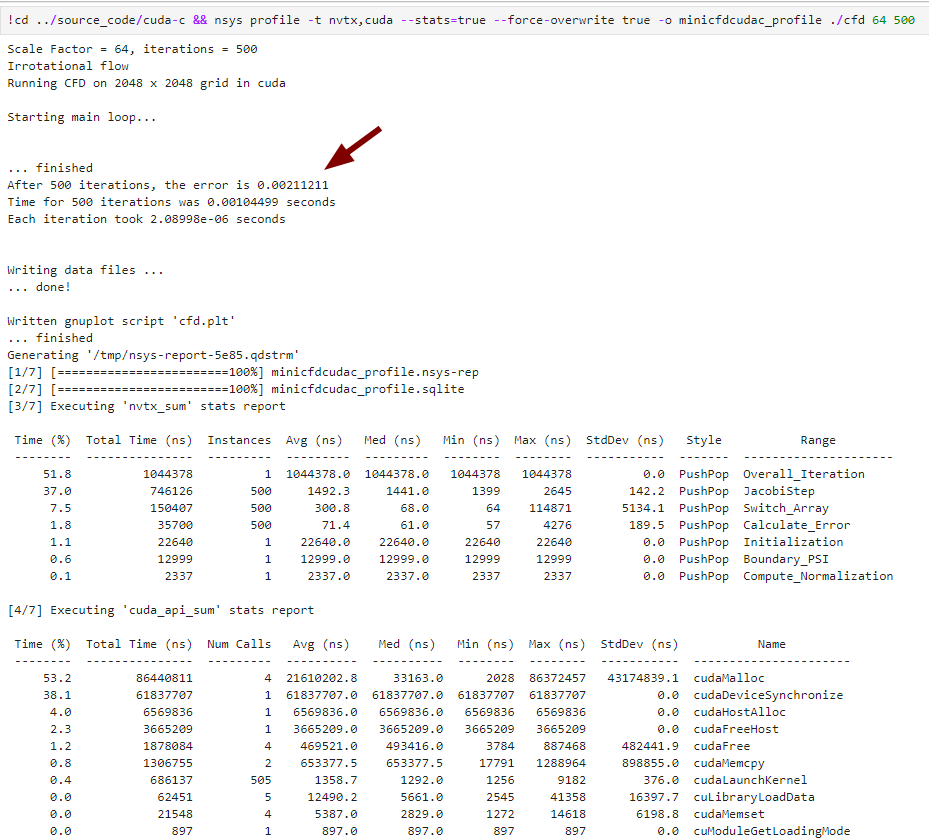

Solution
---

This is not the official solution but my personal solution... Maybe you can do better than me. I would like to thank Kayran Schmidt for his help in figuring out how to set up cuda one correctly. 

### Result Table

All of these are C/C++ version:

* Running Time is for 500 iterations. with running command `./cfd 64 500`

* All of following are tested on: Desktop setting: i9-12900KF, GPU 3090, with [Dockerfile](../Dockerfile) environment.

* Except the first Raw, all other are use the improved serial code as the base file.

|  Approach  | Running Time(s) | Description  |
| ---------- | ----------- | ------------ |
| Raw Serial Baseline        | 7.2941    |   Problem: redundant on swap things|
| ✔️ Improved Serial Baseline      | 4.32531    |   Improve: raw, commit: [9d4139](https://github.com/Kin-Zhang/nways_accelerated_programming/tree/9d4139039d5cc0ece32c69aa76440667338e967a), @(Paul Hoffrogge) is the one who find this |
| ✔️ Compiler Optimization `-O3`      | 1.0917    |  adding `-O3` in CFLAGS on Makefile, compiler optimization  |
| ✔️ ISO stdpar     | 0.0655479    |  v2 std::par inside jacobistep, counting_iterator needed for the fastest speed. complie w gpu  |
| ✔️ OpenACC     | 0.064914    |  check [openacc\jacobi.cpp](openacc\jacobi.cpp). run w gpu  |
| 🔘 OpenMP     | 0.436107    |  check [openmp\jacobi.cpp](openmp\jacobi.cpp). run w gpu  |
| ✔️ CUDA unified Memory | 0.063468  |  the easiest way to do cuda, commit: [0d906ccbe2](https://github.com/Kin-Zhang/nways_accelerated_programming/tree/0d906ccbe205e189cb1771c29abcf733d4a8b8a1)  |
| ✔️ CUDA best     |  0.00104499  |  all device memory and no sync duration cal, sync at end. error result is correct as serial code: the error is 0.00211211  |

Best screenshot, error checked same with serial code, always 0.00211211:

